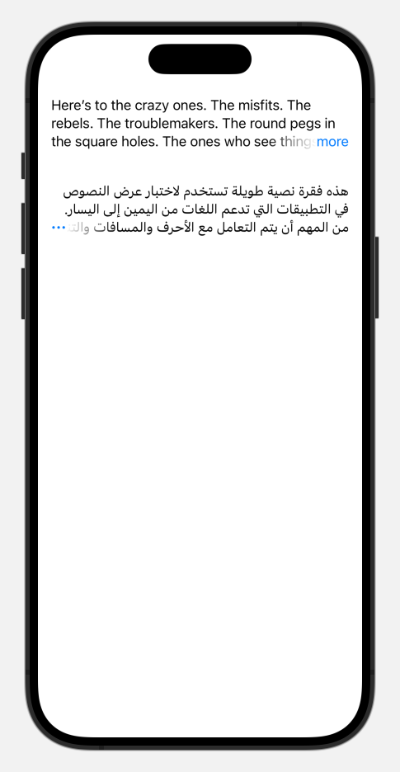
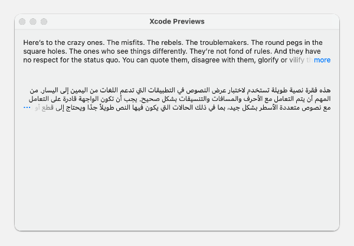

# Expandable

## Overview

This package provides a customizable, cross-platform SwiftUI view that mimics the expandable app description UI found in the App Store.

## Features

- Cross platform: iOS 16, watchOS 9, macOS 13
- No UIKit dependency
- No external dependencies
- Ergonomic, SwiftUI-y API
- Customizable expand button
- VoiceOver and Dynamic Type support
- Right-to-left (RTL) layout support

## Installation

Add this package to your project using Swift Package Manager:

1. In Xcode, go to **File > Add Packages...**
2. Enter the repository URL or path for this package.
3. Add the package to your project.

Alternatively, add the following to your `Package.swift` dependencies:

```swift
dependencies: [
    .package(url: "https://github.com/ryanashcraft/Expandable.git", from: "1.0.0")
]
```

## Screenshots

### iOS


### macOS


### watchOS


## Usage

Below is an example of how to use the Expandable view in SwiftUI.

```swift
import SwiftUI
import ExpandableView

struct ContentView: View {
    var body: some View {
        ScrollView {
            Expandable {
                Text("Here’s to the crazy ones. The misfits. The rebels. The troublemakers. The round pegs in the square holes. The ones who see things differently. They’re not fond of rules. And they have no respect for the status quo. You can quote them, disagree with them, glorify or vilify them. About the only thing you can’t do is ignore them. Because they change things. They push the human race forward. And while some may see them as the crazy ones, we see genius. Because the people who are crazy enough to think they can change the world, are the ones who do.")
            } buttonLabel: {
                Text("more")
            }
            .lineLimit(3)
        }
    }
}
```

## License

This package is released under the MIT License. See [LICENSE](/LICENSE) for details.

